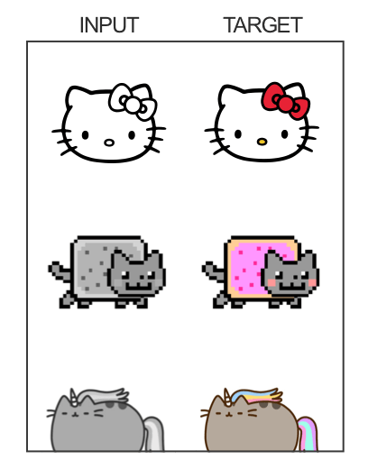
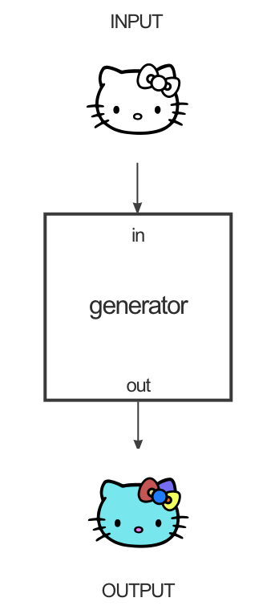
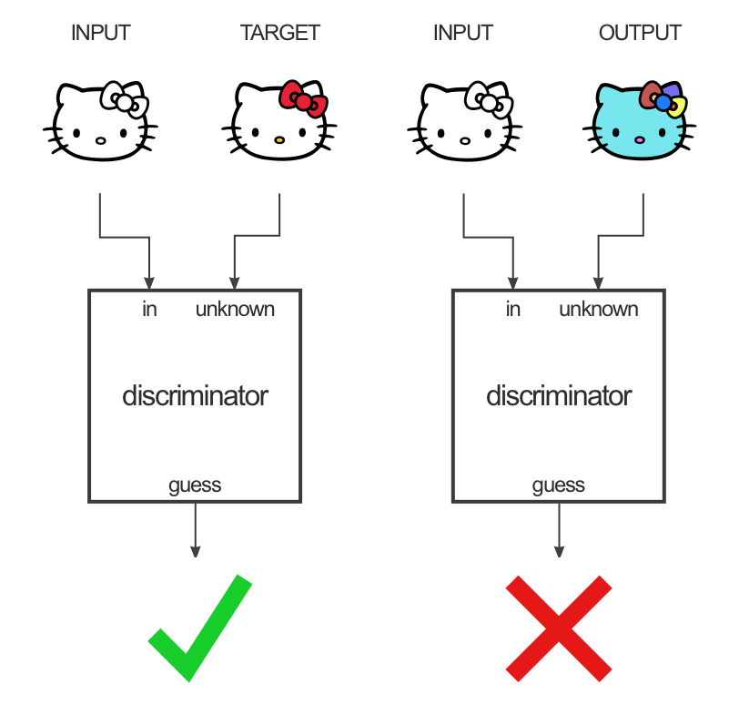
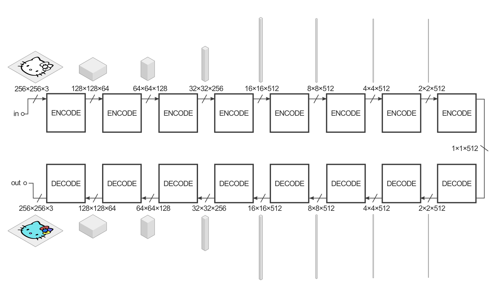
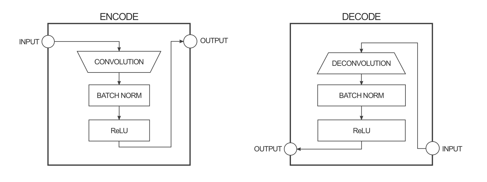
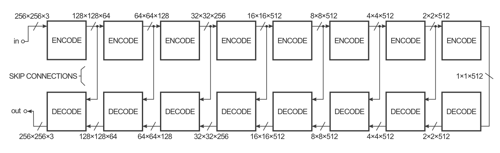
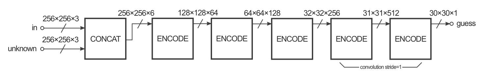
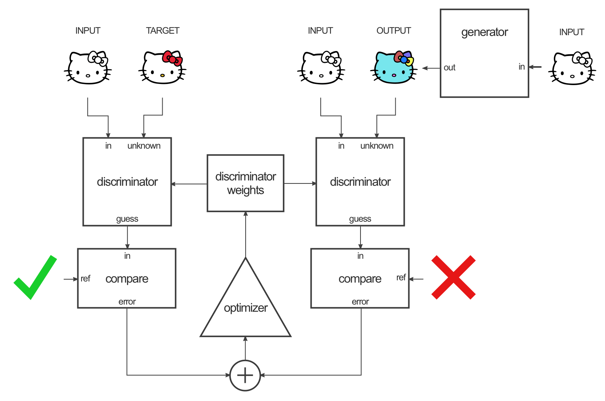
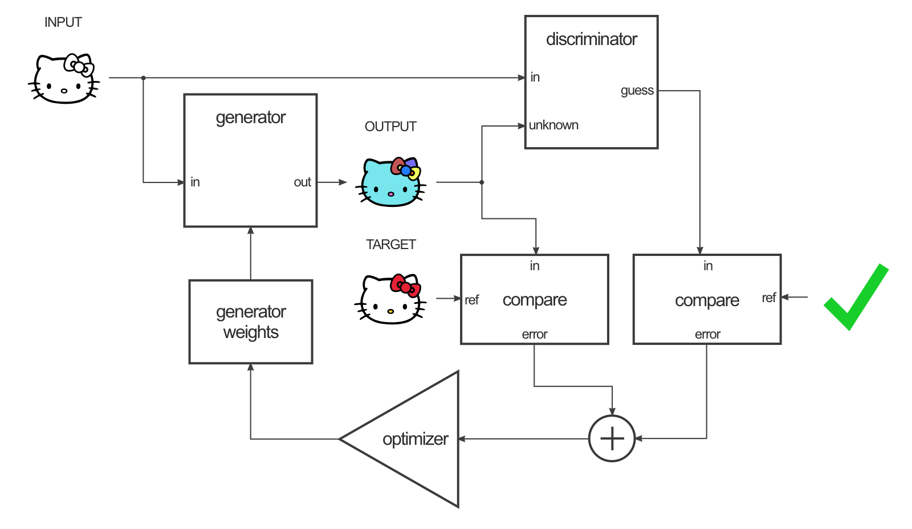
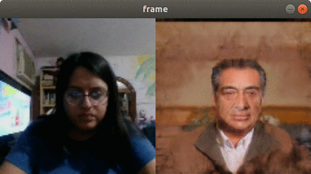

# Face2face

Objetivo: Encontrar un proyecto creado que use redes convolucionales y utilizarlo con tus datos para resolver un problema nuevo o bien cubrir la misma finalidad que el proyecto original para la clase de Redes Neuronales. 

El proyecto que escogi fue face2face el cual consiste en, por medio de aplicaciones y gracias al modelo de entrenamiento pix2pix y un modelo preentrenado de reconocimiento de puntos de referencia facial , imitar gestos o movimiento facial en tiempo real a través de una cámara dado un video con un rostro en particular el cual realizará la imitación.

La página original a la que se le atribuye este proyecto es la siguiente: https://github.com/datitran/face2face-demo
Ahi encontrarás las mismas indicaciones (en inglés) que adelante explicaré para desarrolar el proyecto tu mismo.

## ¿En qué consiste el modelo pix2pix?


El modelo pix2pix que se utiliza es una implementación en tensorflow por Christopher Hesse [ver](https://github.com/affinelayer/pix2pix-tensorflow) del modelo pix2pix de Phillip Isola [ver](https://phillipi.github.io/pix2pix/)

Pix2pix usa una red de confrontación generativa condicional (cGAN) para aprender un mapeo de una imagen de entrada a una imagen de salida. La red se compone de dos piezas principales: el Generador y el Discriminador. El generador aplica alguna transformación a la imagen de entrada para obtener la imagen de salida. El Discriminador compara la imagen de entrada con una imagen desconocida (ya sea una imagen objetivo del conjunto de datos o una imagen de salida del generador) e intenta adivinar si fue producida por el generador.
Un ejemplo de un conjunto de datos sería que la imagen de entrada es una imagen en blanco y negro y la imagen objetivo es la versión en color de la imagen:



El generador en este caso está tratando de aprender cómo colorear una imagen en blanco y negro:



El discriminador está mirando los intentos de colorización del generador y tratando de aprender a distinguir la diferencia entre las colorizaciones que proporciona el generador y la imagen objetivo coloreada verdadera proporcionada en el conjunto de datos.



El generador tiene la tarea de tomar una imagen de entrada y realizar la transformación que deseamos para producir la imagen objetivo. Una entrada de ejemplo sería una imagen en blanco y negro, y queremos que la salida sea una versión coloreada de esa imagen. La estructura del generador se denomina "codificador-decodificador" y en pix2pix el codificador-decodificador se parece más o menos así:



Los volúmenes están ahí para darle una idea de la forma de las dimensiones del tensor junto a ellos. La entrada en este ejemplo es una imagen de 256x256 con 3 canales de color (rojo, verde y azul, todos iguales para una imagen en blanco y negro), y la salida es la misma.
El generador toma algo de entrada e intenta reducirlo con una serie de codificadores (función de convolución + activación) en una representación mucho más pequeña. La idea es que al comprimirlo de esta manera, esperamos que tengamos una representación de los datos de mayor nivel después de la capa de codificación final. Las capas de decodificación hacen lo contrario (deconvolución + función de activación) e invierten la acción de las capas del codificador.



Para mejorar el rendimiento de la transformación imagen a imagen en el documento, los autores utilizaron una "U-Net" en lugar de un codificador-decodificador. Esto es lo mismo, pero "omitiendo conexiones" conectando directamente las capas del codificador a las capas del decodificador:



Las conexiones de omisión le dan a la red la opción de omitir la parte de codificación / decodificación si no tiene un uso para ello.
Estos diagramas son una ligera simplificación. Por ejemplo, la primera y la última capa de la red no tienen una capa de norma por lotes y algunas capas en el medio tienen unidades de deserción. El modo de colorización utilizado en el papel también tiene un número diferente de canales para las capas de entrada y salida.

El Discriminador tiene la tarea de tomar dos imágenes, una imagen de entrada y una imagen desconocida (que será una imagen de destino o de salida del generador), y decidir si la segunda imagen fue generada por el generador o no.



La estructura se parece mucho a la sección del codificador del generador, pero funciona de manera un poco diferente. La salida es una imagen de 30x30 donde cada valor de píxel (0 a 1) representa cuán creíble es la sección correspondiente de la imagen desconocida. En la implementación pix2pix, cada píxel de esta imagen de 30x30 corresponde a la credibilidad de un parche de 70x70 de la imagen de entrada (los parches se superponen mucho ya que las imágenes de entrada son de 256x256). La arquitectura se llama "PatchGAN".


Para entrenar esta red, se siguen dos pasos: entrenar al discriminador y entrenar al generador.
Para entrenar al discriminador, primero el generador produce una imagen de salida. El discriminador mira el par de entrada/objetivo y el par de entrada/salida y hace su conjetura acerca de qué tan realistas se ven. Los pesos del discriminador se ajustan según el error de clasificación del par de entrada/salida y el par de entrada/objetivo.



Los pesos del generador se ajustan según la salida del discriminador y la diferencia entre la salida y la imagen objetivo.



El truco inteligente aquí es que cuando entrenas el generador en la salida del discriminador, en realidad estás calculando los gradientes a través del discriminador, lo que significa que mientras el discriminador mejora, estás entrenando al generador para vencer al discriminador.
La teoría es que a medida que el discriminador mejora, también lo hace el generador. Si el discriminador es bueno en su trabajo y el generador es capaz de aprender la función de mapeo correcta a través del descenso de gradiente, debe obtener salidas generadas que podrían engañar a un humano.


## Requerimientos
- [Anaconda / Python 3.5](https://www.continuum.io/downloads)
- [TensorFlow 1.2](https://www.tensorflow.org/)
- [OpenCV 3.0](http://opencv.org/)
- [Dlib 19.4](http://dlib.net/)

¿Cómo usarlo?

## Comenzando
Para comenzar necesitamos crear nuestro ambiente de desarrollo, para ello necesitamos 

```
# Creando entorno desde archivo
conda env create -f environment.yml

```
y activarlo por supuesto

```
#activando entorno
source activate face2face-demo
```

## Generando los datos de entrenamiento

Para generar los datos de entrenamiento se necesita un modelo que detecte puntos de referencia facial (posiciones de ojos, boca, nariz etc). Existe ya un modelo preentrenado que puede descargarse [aquí](http://dlib.net/files/shape_predictor_68_face_landmarks.dat.bz2).

```
python generate_train_data.py --file elBronco.mp4 --num 400 --landmark-model shape_predictor_68_face_landmarks.dat
```

Input:

- `file` Nombre del video del cual se generaran los datos de entrenamiento.
- `num` numero de datos de entrenamiento o frames que se crearan.
- `landmark-model` es el modelo que se usa para detectar puntos claves en el rostro. 

Output:

- Dos folders: `original` y `landmarks` .


## Entrenando los datos

```
# Clone the repo from Christopher Hesse's pix2pix TensorFlow implementation
git clone https://github.com/affinelayer/pix2pix-tensorflow.git

# Move the original and landmarks folder into the pix2pix-tensorflow folder
mv face2face-demo/landmarks face2face-demo/original pix2pix-tensorflow/photos

# Go into the pix2pix-tensorflow folder
cd pix2pix-tensorflow/

# Resize original images
python tools/process.py \
  --input_dir photos/original \
  --operation resize \
  --output_dir photos/original_resized
  
# Resize landmark images
python tools/process.py \
  --input_dir photos/landmarks \
  --operation resize \
  --output_dir photos/landmarks_resized
  
# Combine both resized original and landmark images
python tools/process.py \
  --input_dir photos/landmarks_resized \
  --b_dir photos/original_resized \
  --operation combine \
  --output_dir photos/combined
  
# Split into train/val set
python tools/split.py \
  --dir photos/combined
  
# Train the model on the data
python pix2pix.py \
  --mode train \
  --output_dir face2face-model \
  --max_epochs 200 \
  --input_dir photos/combined/train \
  --which_direction AtoB
```
Para más información sobre el método de entrenamiento, puedes visitar la [implementación de Christopher Hesse](https://github.com/affinelayer/pix2pix-tensorflow).

## Exportando el modelo

1. Primero necesitamos reducir el modelo que entrenamos,es decir reducir los pesos.
    ```
    python reduce_model.py --model-input face2face-model --model-output face2face-reduced-model
    ```
    
    Input:
    
    - `model-input` es el folder donde esta el modelo que entrenamos.
    - `model-output` es el folder donde guardaremos el modelo reducido.
    
    Output:
    
    - Regresa un modelo reducido en pesos.

2. Después convertiremos el modelo reducido en un solo archivo.
    ```
    python freeze_model.py --model-folder face2face-reduced-model
    ```

    Input:
    
    - `model-folder` es el folder dónde se encuentra el modelo reducido.
    
    Output:
    
    - Regresa el modelo congelado en un archivo `frozen_model.pb` dentro del folder que indicamos.

## Ejecutando el resultado

```
python run_webcam.py --source 0 --show 0 --landmark-model shape_predictor_68_face_landmarks.dat --tf-model face2face-reduced-model/frozen_model.pb
```

Input:

- `source` es el índice de dispositivo de la cámara  (default=0).
- `show` es una opción para mostrar la entrada normal (0) o la marca facial (1) junto con la imagen generada(default=0).
- `landmark-model` es el modelo para detectar puntos de referencia facial.
- `tf-model` es nuestro archivo con el modelo congelado.

Resultado:



## Conclusión:

Claramente funciona, sin embargo le falta mucha calidad y se distorciona bastante, le adjudico más esto al bajo poder de cómputo que tengo, el nivel de calidad de la cámara y a la posición no tan parecida con el personaje de mis datos. 
